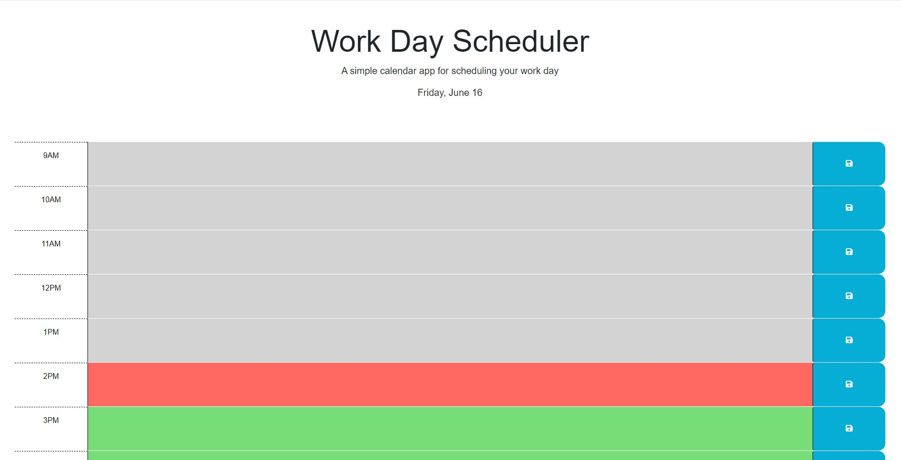

# Work Day Scheduler

A simple calendar app for scheduling your work day.

The site can be accessed [here](https://jonesmatr.github.io/Work-Day-Scheduler/).

## Table of Contents
- [Introduction](#introduction)
- [Usage](#usage)
- [Technologies](#technologies)
- [Setup](#setup)

## Introduction
The Work Day Scheduler is a web application that allows you to schedule and organize your work day. It provides a user-friendly interface where you can input and save tasks for different hours of the day. The time blocks are color-coded to indicate past, present, and future time slots. This helps you easily identify and manage your tasks throughout the day.

## Usage
1. Open the Work Day Scheduler in your web browser.
2. You will see time blocks representing different hours of the work day.
3. Each time block contains a text area where you can enter your task for that specific hour.
4. Click the save button (represented by a floppy disk icon) to save your task.
5. The saved tasks will persist even if you close or refresh the page.
6. The time blocks are color-coded as follows:
   - Past: Gray background color
   - Present: Red background color
   - Future: Green background color

## Technologies
The following technologies are used in this project:
- HTML
- CSS (Bootstrap)
- JavaScript (jQuery)
- [Day.js](https://day.js.org/) (JavaScript library for date and time manipulation)

## Setup
To use the Work Day Scheduler, follow these steps:
1. Clone this repository to your local machine or download the source code files.
2. Open the `index.html` file in your web browser.
3. You can now start scheduling and organizing your work day using the application.

Note: Internet access is required as the application relies on external dependencies, such as Bootstrap, Font Awesome, and Day.js, which are loaded from CDNs.

Feel free to modify and customize the code to suit your specific needs.
